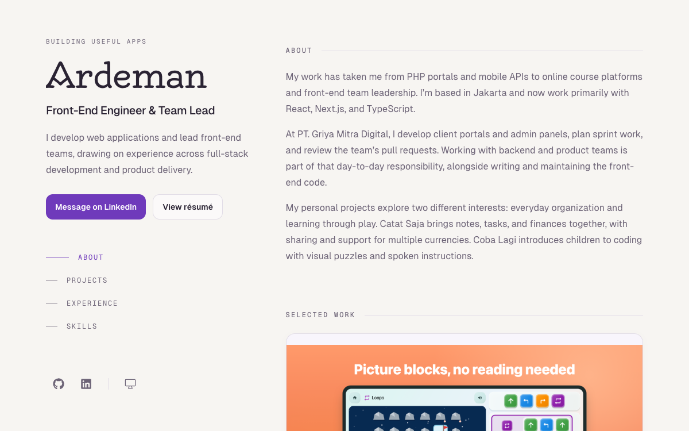

# Ardeman’s portfolio

A personal website for selected work, professional experience, and useful things
built along the way. Built with Next.js, React, TypeScript, and Tailwind CSS, and
published as a static site at [ardeman.com](https://ardeman.com/).

The homepage includes an introduction, selected projects, experience, and skills.
The [project archive](https://ardeman.com/archive) lists original, active GitHub
repositories. Both pages support light, dark, and system themes.



## Getting started

Use Node.js 24.19.0 LTS (`.nvmrc`) and pnpm 12.10.1 (`package.json`). The deployment workflow
uses the same versions. No environment variables or GitHub token are required
for the website or manual LinkedIn synchronization workflow.

```sh
git clone https://github.com/ardeman/project-profile-nextjs.git
cd project-profile-nextjs
pnpm install --frozen-lockfile
pnpm dev
```

Open the local URL printed by Next.js, normally `http://localhost:3000`.
If you use nvm, run `nvm use` before installing dependencies.

Installation runs `prepare` to enable Husky. If hooks are missing, run
`pnpm prepare`. The pre-commit hook uses lint-staged to fix ESLint findings and
format staged files; it does not run a production build.

## Commands

| Task                                  | Command                                       |
| ------------------------------------- | --------------------------------------------- |
| Install locked dependencies           | `pnpm install --frozen-lockfile`              |
| Run the development server            | `pnpm dev`                                    |
| Check lint without changing files     | `pnpm lint:check`                             |
| Fix lint findings                     | `pnpm lint`                                   |
| Check TypeScript                      | `pnpm exec tsc --noEmit`                      |
| Format JavaScript and TypeScript      | `pnpm format`                                 |
| Format root documentation             | `pnpm exec prettier --write "*.md"`           |
| Check root documentation formatting   | `pnpm exec prettier --check "*.md"`           |
| Build the static website into `out/`  | `pnpm build`                                  |
| Preview the static export             | `pnpm start`                                  |
| Refresh the saved GitHub project data | `pnpm refresh:projects`                       |
| Prepare LinkedIn profile text         | `pnpm export:linkedin`                        |
| Test LinkedIn draft generation        | `pnpm test:linkedin`                          |
| Generate the current résumé PDF       | `pnpm export:resume`                          |
| Test résumé generation                | `pnpm test:resume`                            |
| Sync a marked GitHub profile README   | `pnpm sync:github-profile /path/to/README.md` |
| Test GitHub profile synchronization   | `pnpm test:github-profile`                    |
| Enable local Git hooks                | `pnpm prepare`                                |

`pnpm start` serves `out/` with `serve`; it requires a completed build and can
fetch the preview utility through pnpx. It does not start a Next.js application
server. Use the URL printed by the preview command; Next.js development and the
preview utility may both try port 3000.

### Checks

For application, styling, configuration, or content changes, run:

```sh
pnpm lint:check
pnpm exec tsc --noEmit
pnpm build
```

All three must pass. Next.js 16 does not run ESLint during builds, so the
separate lint check is required. The generated development route validator is
excluded from TypeScript checking because Next.js 16.4 emits unused
API-route imports for this static site; production route validation and strict
source checks remain enabled. The build parses the profile CSV files and verifies that
both routes can be exported. Run `pnpm test:linkedin` when changing the LinkedIn
generator or its workflow. Run `pnpm test:resume` when changing the résumé
generator, shared CSV helpers, or build integration. Run `pnpm test:github-profile`
when changing GitHub profile synchronization or shared CSV helpers. These Node tests cover exports; the application
has no automated browser suite, so these commands do not replace checking the UI.

For documentation-only changes, check Markdown formatting and local links. A
build is also needed if you changed a documented command or its implementation.

### Checking UI changes

Use the development server while editing and the static preview before shipping.
Check the homepage and archive at 320px, 375px, 768px, 1024px, and 1440px widths,
including a desktop window about 600px tall.

- Inspect both themes, text wrapping, screenshot framing, and horizontal overflow.
- On mobile, check that section navigation stays visible and anchor targets land
  below it. On desktop, check the sidebar and active section indicator.
- Use the keyboard: skip link, navigation, buttons, skill filters, project details,
  and earlier experience. Check visible focus, Escape in the theme picker, and
  focus returning to its trigger.
- Check theme persistence, system theme changes, and reduced-motion settings.
- Block requests to `api.github.com` in browser tools: saved projects should remain
  visible, with a small refresh control. Check a successful refresh too.
- Disable JavaScript: introduction, About, projects, and experience should still
  render, and native details controls should still open.

### Dependency maintenance

Run `pnpm outdated` to check newer releases and `pnpm audit` to check the entire
locked dependency tree for known advisories. These require npm registry access.
An audit with no findings only covers advisories known at the time of the check.
Dependabot checks npm packages and GitHub Actions weekly and opens reviewable
update pull requests; updates still need the checks and browser review above.

Keep Next.js and `eslint-config-next` aligned, and React and React DOM aligned.
Node type definitions follow the Node 24 runtime. TypeScript stays on the newest
6.0 patch supported by `@typescript-eslint/parser`; TypeScript 7 is outside its
current peer range. Upgrade that range only after parser support is available.
ESLint 10 is the current non-deprecated release. Three Next.js lint plugins still
advertise ESLint 9 peers; narrowly scoped exceptions in `pnpm-workspace.yaml`
allow ESLint 10, verified by the lint check. Remove the exceptions when their
upstream peer ranges support ESLint 10.

One development-only advisory remains in `braces@3.0.3`, through Next.js’s ESLint
plugin and `fast-glob`: [GHSA-vfj7-8cjw-p6xm](https://github.com/advisories/GHSA-vfj7-8cjw-p6xm).
No patched release was published as of 2026-10-09. It processes repository glob
patterns during linting, not public input in the exported site. Keep it visible
in `pnpm audit` and update when an upstream fix is available.

ESLint uses `eslint.config.mjs`; shared import restrictions and naming rules
remain there. Tailwind uses `@tailwindcss/postcss` and CSS theme configuration. Development
and builds explicitly retain webpack, avoiding Turbopack worker-port restrictions
in sandboxed environments.
Tailwind 4 requires Safari 16.4+, Chrome 111+, and Firefox 128+.

### Commits

Use Conventional Commit subjects: `type(scope): description`, with an optional
scope and `!` for breaking changes. Examples: `docs: explain portfolio setup`,
`fix(theme): keep option focus inside the menu`, and `style: refine project cards`.
Common types are `feat`, `fix`, `docs`, `style`, `refactor`, `perf`, `test`, `build`,
`ci`, `chore`, and `revert`. This convention is documented; the current hooks do
not validate commit subjects.

## Project layout

```text
src/
  app/                  Routes, root layout, providers, metadata routes
  components/
    base/               Reusable controls, headings, badges, cursor glow
    pages/              Homepage and archive composition
    sections/           Header, About, selected projects, experience, skills, footer
  contexts/             Build-provided profile data and client theme state
  lib/                  Server-side profile CSV parsing
  data/                 Curated project copy, saved GitHub metadata, résumé details
  apis/                 Bounded, cancellable browser GitHub requests
  hooks/                Project query with saved-data fallback
  constants/            Page metadata, viewport colors, GitHub username
  styles/               Theme tokens, shared styles, and local font imports
  types/                Shared profile and project types
  utils/                Experience dates and skill categories/icons
public/
  linkedin/             Public profile content in CSV files
  documents/            Generated current résumé PDF
  images/               Project screenshots, sharing card, and favicons
scripts/                GitHub refresh, shared CSV helpers, LinkedIn/PDF exports, profile sync and tests
.github/workflows/      GitHub Pages deployment, résumé artifact, LinkedIn drafts
.husky/                 Pre-commit hook
```

## Updating content

### Profile and About

| Content                                                      | Source                                                                   |
| ------------------------------------------------------------ | ------------------------------------------------------------------------ |
| Name, professional role, and About paragraphs                | `public/linkedin/Profile.csv` (`First Name`, `Headline`, `Summary`)      |
| Short introduction below the role                            | `public/linkedin/Profile Summary.csv` (`Profile Summary`)                |
| Experience                                                   | `public/linkedin/Positions.csv`                                          |
| Skills                                                       | `public/linkedin/Skills.csv`                                             |
| Eyebrow tagline, contact action, résumé link, and navigation | `src/components/sections/header/index.tsx`                               |
| Social links                                                 | `src/components/sections/header/data.tsx`                                |
| Browser name heading                                         | `src/components/sections/header/index.tsx` (currently literal `Ardeman`) |
| Search description and sharing metadata                      | `src/constants/metadata.ts`                                              |

These are curated CSV files using the LinkedIn export layout. Keep their column
headers, quote fields containing commas, and use literal `\n` between About
paragraphs. The single-column introduction file also needs quotes when its text
contains commas.

`src/lib/profile.ts` parses the files during rendering/building. Parse errors or
a missing headline/introduction fail the build. In development, refresh the page
after changing a CSV file; production content changes require a rebuild.

The `First Name` column is parsed, but the displayed name is currently written
in the header and page metadata. If changing identity, update those together.
Everything under `public/`, including CSV files and the résumé, is publicly
accessible after deployment. Keep only information intended for publication.

### GitHub profile synchronization

The [GitHub profile README](https://github.com/ardeman/ardeman) uses the same
curated CSVs as the portfolio. Its introduction, About, all skills, and first
three positions are generated by `scripts/sync-github-profile.mjs`. The résumé
link points to the PDF generated by the portfolio build.

The [push-triggered workflow](.github/workflows/sync-github-profile.yml) runs on
every push to portfolio `main` and triggers the
[destination workflow](https://github.com/ardeman/ardeman/blob/main/.github/workflows/sync-profile.yml).
That workflow reads the latest portfolio `main` and commits only when generated
README content changes. There is no hourly schedule. To retry or sync manually,
use **project-profile-nextjs → Actions → Sync GitHub profile → Run workflow**.
The destination workflow can also run manually.

Cross-repository triggering requires a token because the default `GITHUB_TOKEN`
is scoped to the repository running the workflow. One-time setup:

1. Create a [fine-grained personal access token](https://github.com/settings/personal-access-tokens/new)
   owned by `ardeman`, limited to the **ardeman/ardeman** repository, with
   **Repository permissions → Actions → Read and write**. Set an expiration and
   replace the secret when the token expires. No Contents write permission is
   needed for this dispatch token.
2. Add it as **PROFILE_SYNC_TOKEN** in
   [project-profile-nextjs Actions secrets](https://github.com/ardeman/project-profile-nextjs/settings/secrets/actions).
3. Run **Sync GitHub profile** once to verify setup. Subsequent pushes trigger it
   automatically. Missing credentials produce an explicit workflow error.

The token only dispatches the destination workflow; that workflow uses its own
`GITHUB_TOKEN` to commit the README. No local `.env` or browser credentials are
needed. Never commit the token or paste it into profile data.
The navigation links, selected project table, and expandable GitHub activity
section remain manually editable in the profile repository. Recent experience
is expandable, and skills use compact code labels; change their presentation in
the generator so future syncs preserve it.
Keep generated copy between the `portfolio-profile:intro:start/end` and
`portfolio-profile:details:start/end` HTML comment markers. Edit the CSVs to
change that copy; the next sync replaces edits inside those sections.

To sync a local checkout of the profile repository:

```sh
pnpm sync:github-profile /path/to/ardeman/README.md
pnpm test:github-profile
```

The generator requires one correctly ordered, non-overlapping pair of markers
for each section. It validates all CSV inputs before writing and preserves the
existing README when validation fails. Running it again with identical inputs
does not rewrite the file. Keep marker setup deliberate when adopting another
README; the generator never replaces an unmarked document.

### LinkedIn update drafts

The repository is the source for curated profile wording. The
[LinkedIn workflow](.github/workflows/linkedin-update.yml) prepares a fresh draft
when `public/linkedin/*.csv` changes are pushed to `main`. Changes to the generator,
its tests, shared CSV helper, workflow, or package files also trigger it. Unrelated website edits do
not trigger a draft. It can also run manually from **Actions → Prepare LinkedIn
profile update → Run workflow** after the workflow is pushed to GitHub.

Open a successful run and download the `linkedin-profile-update` artifact from
the run summary. Extract the files and follow `manual-sync-checklist.txt` while
editing your LinkedIn profile. Each artifact belongs to its run's source commit
and is retained for 30 days; use the latest successful run.

| File                        | Use                                                   |
| --------------------------- | ----------------------------------------------------- |
| `linkedin-profile.txt`      | Review the full profile draft                         |
| `headline.txt`              | Copy the headline without extra labels                |
| `about.txt`                 | Copy About with paragraph breaks                      |
| `experience.txt`            | Match roles and copy their details and descriptions   |
| `skills.txt`                | Compare and add skills individually                   |
| `introduction.txt`          | Optional portfolio introduction                       |
| `manual-sync-checklist.txt` | Track each section, role, completion date, and commit |

Update matching experience entries rather than creating duplicates. Verify saved
changes on your profile and record completion in the checklist. The generator
does not read LinkedIn, so review any extra roles or skills manually before
removing them. Checklists start unchecked on every export; completing one does
not notify GitHub. Keep your completed copy locally.

To generate the same draft locally:

```sh
pnpm export:linkedin
```

The output folder is `build/linkedin-update/`, ignored by Git and
kept outside the public website. CSV errors fail generation before replacing an
existing draft. Literal `\n` About separators become paragraphs, experience
descriptions become separate bullets, and blank end dates become `Present`.

This prepares text; it does not publish profile edits to LinkedIn. LinkedIn's
[profile-edit APIs require approved access](https://learn.microsoft.com/en-us/linkedin/shared/integrations/people/profile-edit-api/certifications).
The workflow needs no LinkedIn token, password, or browser session. Profile data
is already public in this repository; drafts include only the selected fields,
not extra CSV columns such as addresses.

### Selected projects and the archive

- Edit `src/data/featured-projects.ts` to choose homepage projects and update their
  titles, descriptions, technologies, image paths, and link labels. Each `name`
  must match a repository in the saved GitHub data.
- Save authentic screenshots in `public/images/projects/` and update their alt
  text in the featured project data. The UI uses an 8:5 image frame. Add an
  optional `darkImage` with the same framing to follow the portfolio’s resolved
  theme; projects without it use their default `image` in both themes.
- The archive excludes forks, archived repositories, and the GitHub profile
  repository. Featured projects use their configured order.

GitHub metadata is committed in `src/data/projects.json`. The browser renders
that snapshot first, then requests current public metadata with at most ten
pages, a ten-second overall timeout, cancellation, and one retry. A failed refresh
keeps the saved data. The featured
list also falls back to its saved entry if a live result omits that repository.

To refresh the snapshot before a release:

```sh
pnpm refresh:projects
pnpm build
```

The refresh script requires network access, limits requests to ten pages and
fifteen seconds overall, and leaves the saved file unchanged if a request fails.
Review the resulting diff before committing. When changing
the GitHub account, update both `src/constants/github.ts` and the username in
`scripts/refresh-projects.mjs`, then regenerate the snapshot.

### Résumé and sharing images

The current résumé is generated at `public/documents/resume.pdf`. The header and
experience section both use the stable `/documents/resume.pdf` URL. `pnpm dev`
generates it at startup; `pnpm build` regenerates it before static export, so a
push to `main` automatically publishes an updated PDF with the website.

The generator reads headline, About, name, location, experience, and skills from
the curated CSVs. Education and contact details live in `src/data/resume.json`,
preserved from the original PDF. Keep that file accurate alongside profile edits.
The generated PDF uses selectable text, standard PDF fonts, A4 pages, automatic
wrapping, and page breaks that keep ordinary experience entries together.
Characters outside the standard font encoding fail generation rather than
silently disappearing; adding broader language support requires embedding a
suitable font.

To regenerate after CSV edits during a running development session:

```sh
pnpm export:resume
```

The PDF is generated output and is ignored by Git. Commit its CSV inputs,
supplemental details, and generator instead. Invalid data leaves the previous
PDF intact and fails the build.

The Pages workflow also uploads a `resume-pdf` artifact, retained for 30 days,
so the PDF can be downloaded from a successful run. No LinkedIn API access or
credentials are involved. To update the LinkedIn profile's attached résumé,
download this PDF and replace the attachment manually.

The sharing image is `public/images/social-preview.png`; update it and the
portfolio screenshot when the introduction or visual identity changes.

The committed screenshots and sharing image are bitmap assets. There is no
committed screenshot renderer; use a browser capture or a design tool, keep the
sharing image at 1200×630, and review the actual result.

## Styling

The editorial design uses Oldenburg for the name, Geist Sans for body text, and
Geist Mono for dates, labels, and technology tags. Fonts are bundled locally.

Theme colors live in `src/styles/tailwind.css` and are exposed through
Tailwind CSS 4’s `@theme inline` in that file: `canvas`, `surface`, `ink`, `muted`, `line`, `accent`,
`accent-soft`, and `on-accent`. Update these tokens to change the palette.
Shared button, icon, heading, and link styles live alongside them. Global focus
and reduced-motion rules live in `src/styles/globals.css`.

The root layout applies the saved theme before painting. The theme context then
manages persistence and system changes. Keep both paths consistent, including
when localStorage is unavailable. Viewport/browser theme colors live separately
in `src/constants/viewport.ts`.

## Deployment

[`.github/workflows/nextjs.yml`](.github/workflows/nextjs.yml) builds and deploys
`out/` to GitHub Pages on every push to `main`. It also supports a manual run.
A push to `main` is therefore a publication action, including documentation-only
pushes. The workflow does not refresh the saved GitHub data automatically.

GitHub Pages must be configured to use GitHub Actions. The public URL is
`https://ardeman.com/`. This project uses `output: 'export'`, an empty `basePath`,
and unoptimized images. A deployment under a repository subpath needs a separate
review of absolute asset URLs and navigation links.

Before publishing, run [Checks](#checks), inspect the [UI](#checking-ui-changes),
and review the content changes. After the workflow finishes, check the homepage,
archive, résumé, images, and sharing metadata on the published site.

## Troubleshooting

- **Missing generated manifests or changing build output:** development and
  production commands share `.next/`. Run them sequentially, or validate in a
  separate checkout. Avoid clearing the output of an active development server.
- **Profile build error:** check CSV quoting and headers, plus the required
  headline and introduction. About paragraph separators are literal `\n`.
- **Saved project data looks old:** run `pnpm refresh:projects`. GitHub access is
  optional for viewing saved content, but required for refreshing it.
- **A plain file server returns 404 for `/archive`:** use `pnpm start` to preview
  extensionless routes. A basic server may only serve `archive.html` directly.

## Documentation map

Each topic has one home. Update the owning file instead of copying instructions.

| File                                           | Audience                   | Owns                                                                |
| ---------------------------------------------- | -------------------------- | ------------------------------------------------------------------- |
| [README.md](README.md)                         | Humans and AI agents       | Overview, setup, commands, layout, content, styling, deployment     |
| [AGENTS.md](AGENTS.md)                         | AI agents and contributors | Conventions, guardrails, definition of done, architecture decisions |
| [CLAUDE.md](CLAUDE.md), [GEMINI.md](GEMINI.md) | Claude Code and Gemini CLI | Only an import of `AGENTS.md`                                       |
| [LICENSE](LICENSE)                             | Everyone                   | MIT license terms                                                   |

## License and credit

The code is available under the [MIT license](LICENSE). Keep its copyright and
license notice when reusing it. If you fork this portfolio, please credit
[ardeman.com](https://ardeman.com/). The original layout was inspired by
[Brittany Chiang’s portfolio](https://brittanychiang.com/); the site footer keeps
that credit. Replace personal content, résumé, and project images for your own
portfolio.
